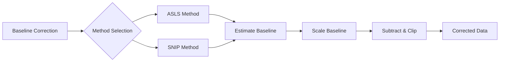

# MassFlow Baseline Correction (baseline_correction.py)

This document describes the baseline correction module in MassFlow, focusing on the core interface in `preprocess/baseline_correction.py` and the unified entry `MSIPreprocessor.baseline_correction`. It includes API descriptions, algorithm principles, parameters and tuning suggestions, example code (from `test_Asls.py` and `test_snip.py`), use cases, and common issues.

- Related Modules
  - `preprocess/baseline_correction.py` (ASLS, SNIP implementations and unified entry)
  - `module/ms_module.py` (spectrum data structures)
  - `preprocess/test_Asls.py` (ASLS example)
  - `preprocess/test_snip.py` (SNIP example)

## Overview

- Input and Output
  - Input: 1D `intensity` (`np.ndarray`) or `module.ms_module.SpectrumBaseModule`
  - Output: a tuple `(corrected, baseline)`:
    - If input is `np.ndarray`: `(np.ndarray corrected, np.ndarray baseline)`
    - If input is `SpectrumBaseModule`: `(SpectrumBaseModule corrected_spectrum, np.ndarray baseline)`; `mz_list` and coordinates are preserved, `intensity` is replaced by the baseline-corrected result.
- Algorithms
  - ASLS (Asymmetric Least Squares): robust baseline estimation with peak preservation.
  - SNIP (Statistics-Sensitive Non-linear Iterative Peak-clipping): progressive clipping with adaptive early stop to prevent over-correction.
- Over-correction prevention
  - `baseline_scale`: scales the estimated baseline by a factor between 0 and 1 (default `0.6`), retaining part of the background to avoid over-subtraction.
  - If you want the original algorithm behavior (no scaling), set `baseline_scale=1.0`.

### Function Relationship Diagram



## Core API

### MSIPreprocessor.baseline_correction

```python
preprocess.MSIPreprocessor.baseline_correction(
  data: np.ndarray | SpectrumBaseModule,
  method: str = "asls",
  lam: float = 1e7,
  p: float = 0.01,
  niter: int = 15,
  baseline_scale: float = 0.6,
  m: int | None = None,
  decreasing: bool = True,
  epsilon: float = 1e-3
) -> tuple[np.ndarray | SpectrumBaseModule, np.ndarray]
```

- Description: Unified baseline correction entry. Dispatches to ASLS or SNIP based on `method`, and returns the corrected signal and the estimated baseline.
- Supported `method`s:
  - `"asls"`: recommended for smooth background removal with peak shape preservation.
  - `"snip"`: iterative peak clipping for fast, robust background suppression with adaptive early stop.
- Returns: A tuple `(corrected, baseline)`; types depend on the input (see Overview).
- Exceptions:
  - `ValueError` (unsupported method)
  - `TypeError` (invalid input type)

#### ASLS (Internal Implementation)

- Goal: Use asymmetric weights to suppress values above the baseline (peaks), while the second-difference smoothness term shapes the baseline.
- Key parameters:
  - `lam` (smoothness weight): range `1e4–1e8`; larger means smoother baseline.
  - `p` (asymmetry factor): range `0.001–0.1`; smaller is more conservative (stronger peak preservation).
  - `niter` (iterations): typical `5–30`; reweighting updates the weights.
- Numerical implementation:
  - Prefer `scipy.sparse` to build the second-difference matrix `D` and solve `(W + λD'D)z = Wy`.
  - Falls back to dense matrices when `scipy` is not available (slower).

#### SNIP (Internal Implementation)

- Goal: Iteratively "clip downward" by comparing the signal to the neighborhood average, progressively suppressing peaks while preserving background.
- Key parameters:
  - `m` (max half-window): default auto `min(50, n//10)`; controls the neighborhood half-width for clipping.
  - `decreasing` (iteration order): `True` runs from coarse to fine (`m..1`), commonly more robust; `False` runs from fine to coarse (`1..m`).
  - `epsilon` (relative change threshold for early stop): `1e-5–1e-3`; larger values stop earlier to prevent over-subtraction.
- Early stop strategy:
  - At each window size, compare the relative change before/after the update; stop if it falls below `epsilon`.

## Quick Start Examples

> The examples below are taken directly from the project test scripts for easy reproduction. Image placeholders are left blank.

### 1. ASLS Example (from `preprocess/test_Asls.py`)

```python
import sys
import os
from pathlib import Path
import numpy as np
import matplotlib.pyplot as plt

sys.path.append(os.path.dirname(os.path.dirname(os.path.abspath(__file__))))
from module.ms_module import SpectrumBaseModule
from preprocess.baseline_correction import MSIPreprocessor

def compute_metrics(mz, y, corrected, baseline):
    negative_ratio = float(np.mean(corrected < 0)) if corrected.size > 0 else 0.0
    corr_all = float(np.corrcoef(y, corrected)[0, 1]) if y.size == corrected.size else float("nan")
    d2 = np.diff(np.asarray(baseline, dtype=float), n=2)
    baseline_smoothness = float(np.sqrt(np.mean(d2 * d2)))
    tic_ratio = float(np.sum(corrected) / max(np.sum(y), 1e-12))
    return {
        "negative_ratio": negative_ratio,
        "corr_all": corr_all,
        "baseline_smoothness": baseline_smoothness,
        "tic_ratio": tic_ratio,
    }

# --- Parameters (ASLS) ---
lam = 5e7
p = 0.008
niter = 25
baseline_scale = 0.9

# --- Data Loading (NPY) ---
intensity_data = np.load(FILE_PATH)
mz_data = np.load(DENOISED_MZ_FILE)
intensity = intensity_data[0] if intensity_data.ndim > 1 else intensity_data
sp = SpectrumBaseModule(mz_list=mz_data, intensity=intensity, coordinates=[0, 0, 0])

# --- Baseline Correction (ASLS) ---
corrected_sp, estimated_baseline = MSIPreprocessor.baseline_correction(
    data=sp,
    method="asls",
    lam=lam,
    p=p,
    niter=niter,
    baseline_scale=baseline_scale
)

# --- Metrics & Plotting ---
metrics = compute_metrics(sp.mz_list, sp.intensity, corrected_sp.intensity, estimated_baseline)
plt.figure(figsize=(16, 5))
plt.plot(sp.mz_list, sp.intensity, label='Original', color='steelblue', linewidth=1.0)
plt.plot(sp.mz_list, estimated_baseline, label='Estimated Baseline', color='forestgreen', linewidth=1.0)
plt.plot(corrected_sp.mz_list, corrected_sp.intensity, label='Corrected', color='darkorange', linewidth=1.0)
plt.title('ASLS Baseline Correction Visualization'); plt.xlabel("m/z"); plt.ylabel("Intensity")
plt.xlim(400, 450); plt.ylim(0, 2); plt.legend(); plt.grid(True, alpha=0.3)
plt.tight_layout(); plt.savefig(OUTPUT_FILENAME, dpi=300); plt.close()
```


### 2. SNIP Example (from `preprocess/test_snip.py`)

```python
import sys
import os
from pathlib import Path
import numpy as np
import matplotlib.pyplot as plt

# Paths & imports
sys.path.append(os.path.dirname(os.path.dirname(os.path.abspath(__file__))))
from module.ms_module import SpectrumBaseModule
from preprocess.baseline_correction import MSIPreprocessor

# Metrics (TIC uses sum of non-negative intensities)
def compute_metrics(mz, y, corrected, baseline):
    negative_ratio = float(np.mean(corrected < 0)) if corrected.size > 0 else 0.0
    corr_all = float(np.corrcoef(y, corrected)[0, 1]) if y.size == corrected.size else float("nan")
    d2 = np.diff(np.asarray(baseline, dtype=float), n=2)
    baseline_smoothness = float(np.sqrt(np.mean(d2 * d2)))
    tic_y = np.sum(np.maximum(0, y))
    tic_corrected = np.sum(np.maximum(0, corrected))
    tic_ratio = float(tic_corrected / max(tic_y, 1e-12))
    return {
        "negative_ratio": negative_ratio,
        "corr_all": corr_all,
        "baseline_smoothness": baseline_smoothness,
        "tic_ratio": tic_ratio,
    }

# Parameters (SNIP)
m = 30                 # Max half-window; None -> auto: min(50, n//10)
decreasing = True      # Coarse to fine (m..1)
epsilon = 1e-5         # Relative change threshold for early stop
baseline_scale = 1.0   # Baseline scaling; 1.0 retains original SNIP behavior

# Data paths (NPY)
PROJECT_ROOT = os.path.dirname(os.path.dirname(os.path.abspath(__file__)))
DATA_DIR = os.path.join(PROJECT_ROOT, "data")
FILE_PATH = os.path.join(DATA_DIR, "neg-gz4_savgol_denoised_intensity.npy")
DENOISED_MZ_FILE = os.path.join(DATA_DIR, "neg-gz4_savgol_denoised_mz.npy")
OUTPUT_FILENAME = "snip_baseline_correction_visualization_400-500.png"

# Load data
intensity_data = np.load(FILE_PATH)
mz_data = np.load(DENOISED_MZ_FILE)
intensity = intensity_data[0] if intensity_data.ndim > 1 else intensity_data
sp = SpectrumBaseModule(mz_list=mz_data, intensity=intensity, coordinates=[0, 0, 0])

# Parameter summary
print(f"[SNIP] m={m}, decreasing={decreasing}, epsilon={epsilon}, baseline_scale={baseline_scale}")

# Baseline correction (SNIP)
corrected_sp, estimated_baseline = MSIPreprocessor.baseline_correction(
    data=sp,
    method="snip",
    m=m,
    decreasing=decreasing,
    epsilon=epsilon,
    baseline_scale=baseline_scale
)

# Metrics & plotting
metrics = compute_metrics(sp.mz_list, sp.intensity, corrected_sp.intensity, estimated_baseline)
plt.style.use('seaborn-v0_8-whitegrid')
plt.figure(figsize=(16, 5))
plt.plot(sp.mz_list, sp.intensity, label='Original', color='#4C78A8', linewidth=1.2, alpha=0.95)
plt.plot(sp.mz_list, estimated_baseline, label='Estimated Baseline', color='#49A27D', linewidth=1.2, alpha=0.95)
plt.plot(corrected_sp.mz_list, corrected_sp.intensity, label='Corrected', color='#F58518', linewidth=1.2, alpha=0.95)

plt.title('SNIP Baseline Correction Visualization')
plt.xlabel("m/z")
plt.ylabel("Intensity")
plt.xlim(400, 450)
plt.ylim(0, 2)
plt.legend()
plt.tight_layout()
plt.savefig(OUTPUT_FILENAME, dpi=300)
plt.close()
```


## Parameter Descriptions and Tuning Suggestions

- General
  - `baseline_scale` (baseline scaling factor): `0.0–1.0`; smaller values prevent over-subtraction. Set `1.0` to keep native algorithm behavior.
- ASLS
  - `lam` (smoothness weight): controls baseline curvature; larger is smoother. Suggested range `1e4–1e8`.
  - `p` (asymmetry factor): smaller values preserve peaks (lower weights on high values). Suggested `0.001–0.1`.
  - `niter` (iterations): `5–30`; more iterations stabilize weights.
- SNIP
  - `m` (max half-window): defaults to `min(50, n//10)`; overly large windows may over-subtract.
  - `decreasing` (window order): `True` (coarse to fine) is typically more robust; `False` (fine to coarse) suits cases focusing on local details first.
  - `epsilon` (early stop threshold): `1e-5–1e-3`; larger values stop earlier to protect details.

## Use Cases

- Smooth background removal with peak preservation: ASLS (suitable for quantitative analysis and shape stability).
- Fast, robust baseline suppression: SNIP (handles mixed sharp/broad peaks efficiently).
- Preventing over-subtraction: lower `baseline_scale` or increase `epsilon` (SNIP).

## Practical Suggestions

- Baseline scaling first: consider `baseline_scale` (e.g., `0.6–0.9`) to avoid over-subtraction.
- Metric evaluation: use the four metrics from the examples:
  - Negative ratio (`negative_ratio`)
  - Correlation with original (`corr_all`)
  - Baseline smoothness (`baseline_smoothness`, RMS of the second derivative)
  - TIC retention ratio (`tic_ratio`)
- Path management: use `\\` separators on Windows; ensure intensity and m/z arrays align when reading NPY files.

## References

- `preprocess/baseline_correction.py` (baseline correction core implementation: ASLS, SNIP)
- `module/ms_module.py` (`SpectrumBaseModule` data structures and visualization)
- `preprocess/test_Asls.py`, `preprocess/test_snip.py` (complete baseline correction examples)