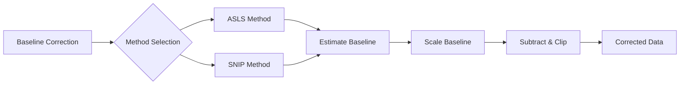

# MassFlow

This document introduces the baseline correction module in MassFlow, focusing on `preprocess/ms_preprocess.py` and the unified entry `MSIPreprocessor.baseline_correction`. It follows the same style as the noise reduction documentation.

## Overview
- Input and output
  - Input: `module.ms_module.SpectrumBaseModule`
  - Output: a tuple `(corrected, baseline)`:
  - `SpectrumBaseModule`: `(SpectrumBaseModule corrected_spectrum, np.ndarray baseline)` with `mz_list` and coordinates preserved.
- Methods
  - ASLS (Asymmetric Least Squares): robust baseline estimation with peak preservation.
  - SNIP (Statistics-Sensitive Non-linear Iterative Peak-clipping): iterative clipping with adaptive early stop.
- Baseline scaling
  - `baseline_scale` scales the estimated baseline by `(0,1]` (default `0.8`) to prevent over-subtraction.
  - The returned baseline is scaled. Set `baseline_scale=1.0` to keep native algorithm behavior.

### Function Relationship Diagram



## Core API

### MSIPreprocessor.baseline_correction
```python
preprocess.ms_preprocess.MSIPreprocessor.baseline_correction(
  data: np.ndarray | SpectrumBaseModule,
  method: str = "asls",
  lam: float = 1e7,
  p: float = 0.01,
  niter: int = 15,
  baseline_scale: float = 0.8,
  m: int = 5,
  decreasing: bool = True,
  epsilon: float = 1e-3
) -> tuple[np.ndarray | SpectrumBaseModule, np.ndarray]
```
- Description: Unified entry for baseline correction. Dispatches to ASLS or SNIP and returns the corrected signal and the scaled estimated baseline.
- Supported methods: `"asls"`, `"snip"`
- Returns: `(corrected, baseline)`; types depend on the input.
- Exceptions: `ValueError` (unsupported method), `TypeError` (invalid input type)

### asls_baseline
```python
preprocess.baseline_correction.asls_baseline(
  y: np.ndarray,
  lam: float = 1e7,
  p: float = 0.01,
  niter: int = 15
) -> np.ndarray
```
- Description: Baseline estimation via asymmetric least squares (ALS); controls smoothness with lambda and asymmetry with p.

### snip_baseline
```python
preprocess.baseline_correction.snip_baseline(
  y: np.ndarray,
  m: int | None = None,
  decreasing: bool = True,
  epsilon: float = 1e-3
) -> np.ndarray
```
- Description: Statistics-sensitive non-linear iterative peak clipping (SNIP); fixed-iteration clipping without adaptive early stop.

## Examples

ASLS:
```python
import numpy as np
from module.ms_module import SpectrumBaseModule
from preprocess.ms_preprocess import MSIPreprocessor
from tools.plot import plot_spectrum

sp = SpectrumBaseModule(mz_list=mz_data, intensity=intensity_original, coordinates=[0, 0, 0])

corrected_sp, baseline = MSIPreprocessor.baseline_correction(
    data=sp,
    method="asls",
    lam=5e7,
    p=0.008,
    niter=25,
    baseline_scale=0.9
)
# Overlay original and corrected on the same axis
plot_spectrum(
    base=sp,
    target=corrected_sp,
    save_path="asls_baseline_correction_visualization_400-500.png",
    figsize=(16, 5),
    dpi=300,
    plot_mode="line",
    mz_range=(400, 450),
    intensity_range=(0.0, 2.0),
    metrics_box=True,
    title_suffix="ASLS",
    overlay=True
)
```


SNIP (overlay plotting):
```python
import numpy as np
from module.ms_module import SpectrumBaseModule
from preprocess.ms_preprocess import MSIPreprocessor

sp = SpectrumBaseModule(mz_list=mz_data, intensity=intensity_original , coordinates=[0, 0, 0])
corrected_sp, baseline = MSIPreprocessor.baseline_correction(
    data=sp,
    method="snip",
    m=30,
    decreasing=True,
    epsilon=1e-5,
    baseline_scale=1.0
)

plot_spectrum(
    base=sp,
    target=corrected_sp,
    save_path="snip_baseline_correction_visualization_400-500.png",
    figsize=(16, 5),
    dpi=300,
    plot_mode="line",
    mz_range=(400, 450),
    intensity_range=(0.0, 2.0),
    metrics_box=True,
    title_suffix="SNIP",
    overlay=True
)
```


## Parameters and Tuning
- General
  - `baseline_scale` (`(0,1]`): smaller values reduce over-subtraction; `1.0` preserves native behavior.
- ASLS
  - `lam` (smoothness): `1e4–1e8`, larger → smoother baseline.
  - `p` (asymmetry): `0.001–0.1`, smaller → stronger peak preservation.
  - `niter` (iterations): `5–30`, more iterations stabilize weights.
- SNIP
  - `m` (max half-window): default `min(50, n//10)`; overly large windows may over-subtract.
  - `decreasing`: `True` (coarse→fine) usually more robust; `False` (fine→coarse) emphasizes local-first.
  - `epsilon` (early stop): `1e-5–1e-3`; larger values stop earlier to protect details.

## Tips
- Ensure `mz` and `intensity` lengths match when reading NPY files.
- Use `metrics_box=True` to visualize SNR, TIC and related metrics inline.
- Overlay mode: set `overlay=True` to plot original and corrected spectra on the same axis. Omit or set `overlay=False` for stacked subplots.

## References
- `preprocess/ms_preprocess.py` (unified entry, parameter defaults)
- `preprocess/baseline_correction.py` (ASLS, SNIP implementations)
- `module/ms_module.py` (`SpectrumBaseModule`, plotting)