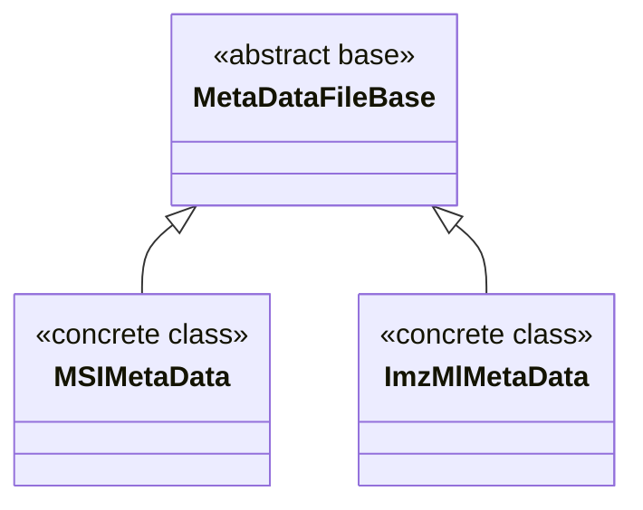

# MassFlow Metadata Module

This document describes the metadata subsystem in MassFlow, focusing on the three classes defined in `module/meta_data.py`: `MetaDataFileBase`, `MSIMetaData`, and `ImzMlMetaData`. It covers their fields, properties, typical usage, and key considerations.

## Overview

- Design
  - Metadata (dataset info, instrument, coordinates, pixel sizes) is modeled as an object independent of the spectrum container `MS`. Data managers (e.g., `MSDataManagerImzML`) attach or update it while reading.
  - All attributes exposed via properties automatically synchronize to the internal dictionary `_meta`, enabling serialization and dict-like access.
- Capabilities
  - Record image size (number of pixels) and physical pixel size (µm).
  - Store occupancy mask (`mask`) and coordinate base (`coordinates_zero_based`).
  - Cache common imzML metadata (spectrum count, instrument model, centroid/profile mode, etc.).
- Core classes
  - `MetaDataFileBase`: abstract base providing auto-sync and dict interfaces.
  - `MSIMetaData`: concrete subclass for MSI matrix-style metadata.
  - `ImzMlMetaData`: concrete subclass for imzML metadata, managing an `ImzMLParser`.



## Core Types

### MetaDataFileBase (abstract)

```python
class module.meta_data.MetaDataFileBase(name, version, storage_mode, ...)
```

- Purpose
  - Provide common metadata fields and property wrappers; setters synchronize values into `_meta` via `self._set(key, value)`.
- Key fields/properties (partial)
  - `name`, `version`, `storage_mode`
  - `max_count_of_pixels_x`, `max_count_of_pixels_y` (pixel count)
  - `pixel_size_x`, `pixel_size_y` (µm)
  - `processed`, `peakpick`
  - `centroid_spectrum`, `profile_spectrum`
  - `mask` (2D array; shape must be `(max_count_of_pixels_y, max_count_of_pixels_x)`)
  - `meta_index` (CV mapping; used for extraction)
- Access
  - Dict-like: `__getitem__`, `keys()`, `items()`, `values()`, `get()`, `to_dict()`.

### MSIMetaData (matrix MSI)

```python
class module.meta_data.MSIMetaData(mask, need_base_mask, mz_num, ...)
```

- Extra fields
  - `need_base_mask`: whether to compute a base mask from intensities.
  - `mz_num`: global m/z count (optional, for statistics/control).
- Usage
  - Non-imzML sources or MSI converted to dense matrix format.
- Behavior
  - Inherits auto-sync: setting attributes writes into `_meta`.

### ImzMlMetaData (imzML)

```python
class module.meta_data.ImzMlMetaData(parser, filepath, coordinates_zero_based, ...)
```

- Initialization
  - Provide either `parser: ImzMLParser` or `filepath: str` (exclusive). With `filepath`, an `ImzMLParser` is created internally.
- Key fields
  - `filepath`, `parser`, `spectrum_count_num`
  - `absolute_position_offset_x`, `absolute_position_offset_y`
  - `instrument_model`, `ms1_spectrum`, `msn_spectrum`
  - `min_pixel_x`, `min_pixel_y`
  - `coordinates_zero_based`
- Validation/sync
  - `filepath` must exist; if `parser` is missing it will be created.
  - `min_pixel_x/min_pixel_y` must satisfy `0 ≤ value ≤ max_count_of_pixels_*`.

## Usage Examples

### Scenario 1: MSI matrix

```python
>>> from module.msi_module import MSI
>>> from module.meta_data import MSIMetaData
>>> import numpy as np
>>>
>>> # 1. Create metadata object
>>> meta = MSIMetaData(name="test_dataset", mz_num=100, need_base_mask=True)
>>>
>>> # 2. Create MSI and attach metadata
>>> msi = MSI(meta=meta)
>>>
>>> # 3. Update metadata (e.g., set mask)
>>> my_mask = np.zeros((10, 10))
>>> msi.meta.mask = my_mask 
>>>
>>> # 4. Access via attribute and dict
>>> print(msi.meta.name)
test_dataset
>>> print(msi.meta['name'])
test_dataset
```

### Scenario 2: imzML

```python
>>> from pyimzml.ImzMLParser import ImzMLParser
>>> from module.ms_module import MS
>>> from module.ms_data_manager_imzml import MSDataManagerImzML

>>> ms = MS() 
>>> ms_dm = MSDataManagerImzML(ms, filepath="data/example.imzML", coordinates_zero_based=True)

>>> # Load spectra and extract metadata
>>> ms_dm.load_full_data_from_file()
>>>
>>> # Access metadata populated via CV index mapping
>>> print(f"X-axis pixels: {ms.meta.max_count_of_pixels_x}")
X-axis pixels: [X value from example.imzML]
>>> print(f"Y-axis pixels: {ms.meta.max_count_of_pixels_y}")
Y-axis pixels: [Y value from example.imzML]
>>> print(f"Does the coordinate system start from 0: {ms.meta.coordinates_zero_based}")
Does the coordinate system start from 0: True
```

## Relation to Data Managers
- `MSDataManagerImzML` constructs and maintains `ImzMlMetaData` while reading, and attaches it to `MS` for subsequent analysis/plotting.
- For coordinate filtering or visualization, read `mask` and pixel size from metadata.

## Notes & Recommendations
- `version` must be positive.
- `filepath` must exist; for `ImzMlMetaData`, provide at least one of `parser` or `filepath`.
- `mask` shape must be `(max_count_of_pixels_y, max_count_of_pixels_x)`.
- Initialize `max_count_of_pixels_*` before setting `min_pixel_*` to pass bounds checks.
- Keep `coordinates_zero_based` consistent with the manager configuration (`MSDataManagerImzML.coordinates_zero_based`).
