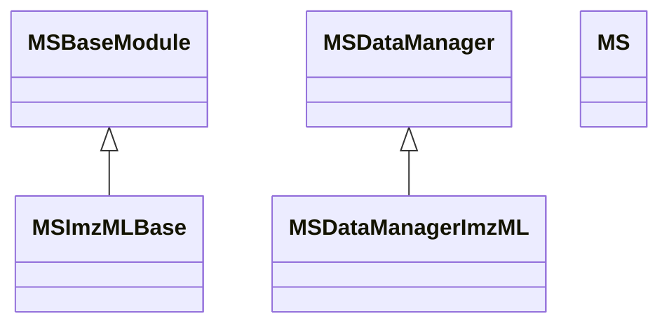

# MassFlow MS Data Structures

This document describes the core data structures used in MassFlow for mass spectrometry (MS) workflows, with focus on loading and organizing spectra from ImzML. It covers the following modules and their relationships:

- `module/ms_module.py`
- `module/ms_data_manager.py`
- `module/ms_data_manager_imzml.py`

The intent is to present implementation-focused details about classes, attributes, indexing patterns, and the lazy-loading data flow.

## Overview

MassFlow separates domain models (data structures) from data managers (I/O and orchestration):

- Domain model
  - `MSBaseModule`: Represents a single spectrum with spatial coordinates.
  - `MSImzMLBase`: Specialized spectrum class for lazy-loading data from ImzML.
  - `MS`: Collection of spectra with efficient coordinate-based indexing.
- Data manager
  - `MSDataManager`: Abstract base class defining common options and interface.
  - `MSDataManagerImzML`: Concrete manager that reads `.imzML` files and populates `MS`.

Metadata is handled separately (see `module/meta_data.py`) and attached to managers/models as needed.


### Class Diagram (Inheritance)

The following diagram shows the inheritance relationships among the core classes described above. `MSImzMLBase` extends `MSBaseModule`, and `MSDataManagerImzML` extends `MSDataManager`. `MS` is a container class and is shown for context (no inheritance).




## Core Types

### MSBaseModule Class

Represents a single mass spectrum bound to spatial coordinates. Key characteristics:

- Attributes
  - `coordinates: List[int]` — 2D or 3D coordinates `[x, y, z]` of the spectrum.
  - `x, y, z: int` — convenience accessors for coordinate components.
  - `_mz_list: Optional[np.ndarray]` — m/z values (supports lazy initialization).
  - `_intensity: Optional[np.ndarray]` — intensities corresponding to m/z values (lazy).
  - `sorted_by_mz_fun: bool` — indicates whether spectra are sorted by m/z.
- Properties
  - `mz_list: np.ndarray` — getter/setter; may be `None` until loaded or set.
  - `intensity: np.ndarray` — getter/setter; may be `None` until loaded or set.
- Utilities
  - `sort_by_mz()` — optional in-place sorting of spectrum by m/z.
  - `plot(...)` — convenience plotting with `line` or `stem` modes.
- Invariants and notes
  - `coordinates` must be 2 or 3 integers; indexing assumes `[x, y, z]` order.
  - `mz_list` and `intensity` must be same length when both are present.
  - Lazy loading is supported via `None` initialization, deferring data acquisition.

### MSImzMLBase Class

Specialized spectrum type for ImzML data. It defers reading of m/z and intensities until first access.

- Additional attributes
  - `_parser: ImzMLParser` — parser instance used to read spectrum data.
  - `_index: int` — spectrum index within the ImzML file.
- Lazy loading behavior
  - On first `mz_list` access, calls `parser.getspectrum(index)` to load m/z and intensity.
  - `intensity` access triggers `mz_list` loading if intensity is not yet available.
- Construction
  - `__init__(parser, index, coordinates)` — stores parser/index, sets mz/intensity to `None`.
  - `creator(parser, index, coordinates)` — convenience classmethod returning a new instance.

### MS Class

Container and manager for multiple spectra, optimized for both sequential iteration and coordinate-based lookup.

- Internal structures
  - `_queue: List[MSBaseModule]` — preserves insertion order; useful for sequential access.
  - `_coordinate_index: Dict` — nested dictionary mapping coordinates to spectra.
    - Structure: `{z: {x: {y: MSBaseModule}}}`
- Indexing patterns
  - `ms[index]` — sequential access into `_queue`.
  - `ms[x, y]` — 2D coordinate access (z defaults to 0).
  - `ms[x, y, z]` — full 3D coordinate access.
  - `ms[x, y, z] = spectrum` — direct assignment.
- Typical operations
  - `add_spectrum(spectrum)` — inserts into `_queue` and `_coordinate_index`.
  - `get_spectrum(x, y, z=0)` — direct retrieval by coordinates.
  - Iteration and plotting helpers are available for downstream visualization.

## Data Managers

### MSDataManager (Abstract)

Defines common configuration and the contract for loading data into an `MS` model.

- Attributes
  - `_ms: MS` — the target domain model to populate.
  - `target_mz_range: Optional[Tuple[float, float]]` — inclusive range `(min_mz, max_mz)` to filter peaks.
  - `target_locs: Optional[List[Tuple[int, int] | Tuple[int, int, int]]]` — a bounding region defined by two coordinates `[(x1, y1), (x2, y2)]` or 3D equivalents; used to limit loaded spectra.
  - `filepath: Optional[str]` — input data path.
  - `current_spectrum_num: int` — running count of loaded spectra.
- Validation
  - Ensures `target_locs` contains at least two points and `x1 < x2`, `y1 < y2`.
- Methods
  - `get_ms() -> MS` — returns the internal `MS` instance.
  - `load_full_data_from_file()` — abstract; to be implemented by concrete managers.
  - `inspect_data(inpect_num=10)` — logs dataset info (count, sample spectra lengths and ranges).

### MSDataManagerImzML

Concrete manager for `.imzML` files. It handles metadata initialization and lazy population of the `MS` collection with `MSImzMLBase` placeholders.

- Attributes
  - `parser: ImzMLParser` — created from `filepath` on initialization.
  - `meta: MetaDataImzMl | MetaDataBase` — metadata wrapper bound to the parser, used to cache commonly used fields.
- Initialization logic
  - Validates and attaches an `ImzMLParser`.
  - If `ms_meta` is not provided, creates `MetaDataImzMl(parser=parser)`.
  - If provided but without a parser, injects the parser; otherwise uses the given metadata.
- Loading algorithm: `load_full_data_from_file()`
  - Validates existence and extension of `filepath` (`.imzML`).
  - Captures and forwards `pyimzml` warnings via the shared logger.
  - Iterates `parser.coordinates` (tuples of `(x, y, z)`):
    - Applies optional spatial filtering using `target_locs` bounding box; defaults to a wide range when not set.
    - Creates `MSImzMLBase(parser=parser, index=i, coordinates=[x-1, y-1, z-1])` and inserts via `MS.add_spectrum(...)`.
    - Increments `current_spectrum_num` for each accepted spectrum.
  - Note: coordinates are converted to zero-based indices by subtracting 1.

## Metadata Dependencies

While not part of the three focus modules, `MetaDataImzMl` (in `module/meta_data.py`) is tightly coupled to `MSDataManagerImzML`:

- It stores and exposes commonly used fields (e.g., image dimensions, pixel sizes, instrument model) and computes `spectrum_count_num` from `parser.coordinates`.
- It can be initialized with either a parser or a file path and will extract metadata via `pyimzml`.

## Data Flow Summary

1. Create an empty `MS` collection.
2. Initialize `MSDataManagerImzML` with the `MS`, optional `target_locs`/`target_mz_range`, and `filepath`.
3. Call `load_full_data_from_file()` to populate `MS` with `MSImzMLBase` placeholders for spectra within the target region.
4. When accessing `mz_list` or `intensity` on an `MSImzMLBase` spectrum, lazy loading fetches the data from the ImzML file via the parser.
5. Metadata remains available through `meta` for consumers that need image dimensions, pixel sizes, instrument model, etc.

## Usage Example

```python
from module.ms_module import MS
from module.ms_data_manager_imzml import MSDataManagerImzML

# 1. Prepare domain model
ms = MS()

# 2. Configure manager with a bounding box and file path
manager = MSDataManagerImzML(
    ms=ms,
    ms_meta=None,                 # or pass a prebuilt MetaDataImzMl
    target_locs=[(0, 0), (100, 100)],  # optional spatial filter
    filepath="/path/to/data.imzML"
)

# 3. Populate MS with lazily-loaded spectra
manager.load_full_data_from_file()

# 4. Inspect dataset structure
manager.inspect_data(inpect_num=5)

# 5. Access spectra by coordinates; data loads on demand
spectrum = ms[10, 20, 0]
print(spectrum.mz_list[:5])  # triggers lazy load
print(spectrum.intensity[:5])
```

## Extensibility Notes

- New managers can subclass `MSDataManager` to support additional formats; adhere to the `load_full_data_from_file()` contract and, if practical, use lazy-loading spectra like `MSImzMLBase`.
- Coordinate normalization (e.g., zero-based offsets) should be consistent across managers to keep `MS` utilities predictable.
- Consider using `target_mz_range` during load to prefilter peaks for large datasets, or leave it for downstream processing depending on performance needs.

## Glossary

- ImzML: An XML-based standard for MSI data storage.
- Spectrum: A pair of arrays `(mz_list, intensity)` associated with specific spatial coordinates.
- Lazy loading: Deferring actual data reading until first access to reduce memory and I/O overhead.