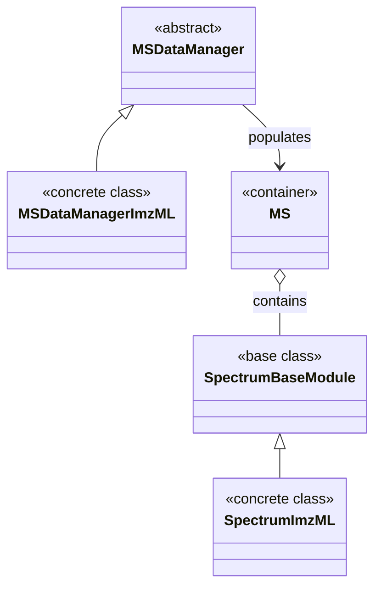

# MassFlow MS Data Structures

This document describes the core data structures used in MassFlow for mass spectrometry (MS) workflows, with focus on loading and organizing spectra from ImzML. It covers the following modules and their relationships:

- `module/ms_module.py`
- `module/ms_data_manager.py`
- `module/ms_data_manager_imzml.py`

The intent is to present implementation-focused details about classes, attributes, indexing patterns, and the lazy-loading data flow.

## Overview

MassFlow separates domain models (data structures) from data managers (I/O and orchestration):

- Domain model
  - `SpectrumBaseModule`: Represents a single spectrum with spatial coordinates.
  - `SpectrumImzML`: Specialized spectrum class for lazy-loading data from ImzML.
  - `MS`: Collection of spectra with efficient coordinate-based indexing.
- Data manager
  - `MSDataManager`: Abstract base class defining common options and interface.
  - `MSDataManagerImzML`: Concrete manager that reads `.imzML` files and populates `MS`.

Metadata is handled separately (see `module/meta_data.py`) and attached to managers/models as needed.


### Class Diagram (Inheritance)

The following diagram shows the inheritance relationships among the core classes described above. `SpectrumImzML` extends `SpectrumBaseModule`, and `MSDataManagerImzML` extends `MSDataManager`. `MS` is a standalone container class with no inheritance.

The `MSDataManager` and its concrete implementations (like `MSDataManagerImzML`) are responsible for populating the `MS` container with spectrum data. The manager holds a reference to an `MS` instance and loads spectra into it through the `load_full_data_from_file()` method. The `MS` container holds multiple `SpectrumBaseModule` instances (or its subclasses like `SpectrumImzML`), organizing them by spatial coordinates for efficient access.




## Core Types

### *SpectrumBaseModule* Class

```python
class module.ms_module.SpectrumBaseModule(mz_list, intensity, coordinates, sorted_by_mz_fun=False)
```

Represents a single mass spectrum bound to spatial coordinates. Key characteristics:

- Parameters
  - `mz_list` (*Optional[np.ndarray]*) — Array of m/z values. Can be `None` for lazy loading.
  - `intensity` (*Optional[np.ndarray]*) — Array of intensity values. Can be `None` for lazy loading.
  - `coordinates` (*List[int]*) — List of three integers `[x, y, z]` representing spatial coordinates.
  - `sorted_by_mz_fun` (*bool, optional*) — Whether the data is already sorted by m/z. Defaults to `False`.
- Properties
  - `mz_list: np.ndarray` — getter/setter; may be `None` until loaded or set.
  - `intensity: np.ndarray` — getter/setter; may be `None` until loaded or set.
- Utilities
  - `sort_by_mz()` — optional in-place sorting of spectrum by m/z.
  - `plot(...)` — convenience plotting with `line` or `stem` modes.
- Invariants and notes
  - `coordinates` must be a list of exactly 3 integers; indexing assumes `[x, y, z]` order.
  - `mz_list` and `intensity` must be same length when both are present.
  - Lazy loading is supported via `None` initialization, deferring data acquisition.

- Example

```python
>>> from tools.plot import plot_spectrum
>>> spectrum = ms[0] or ms.get_spectrum(0, 0, 0)
>>> mz_list = spectrum.mz_list
>>> print(mz_list)
output:
[16441.998  938.1308  2318.6423 ...  1174.1575  1333.138   1488.291 ]
>>> # Plot the spectrum using the standalone plotting utility
>>> plot_spectrum(base=spectrum)
```

- Example2

```python
if __name__ == "__main__":
    from module.ms_data_manager_imzml import MSDataManagerImzML
    from module.ms_module import MS
    from tools.plot import plot_spectrum
    FILE_PATH = "data/example.imzML"
    ms = MS()
    # Create MS collection and manager
    # Auto-created from parser
    with MSDataManagerImzML(ms=ms,target_locs=[(1, 1), (50, 50)],filepath=FILE_PATH) as manager:

        # Load data with lazy-loading placeholders
        manager.load_full_data_from_file()
        spectrum = ms[0]
        plot_spectrum(spectrum)

output:
```


### *SpectrumImzML* Class

```python
class module.ms_module.SpectrumImzML(parser, index, coordinates)
```

Specialized mass spectrum class for ImzML format with lazy loading capabilities. This class extends `SpectrumBaseModule` to provide efficient handling of ImzML (Imaging Mass Spectrometry Markup Language) format data by implementing lazy loading to minimize memory usage.

Note: use [MSDataManagerImzML](#msdatamanagerimzml-class) to automatically create and manage [SpectrumImzML](#spectrumimzml-class).

- Parameters
  - `parser` (*ImzMLParser*) — ImzML parser instance for reading spectrum data from the file.
  - `index` (*int*) — Index of the spectrum within the ImzML file.
  - `coordinates` (*List[int]*) — List of three integers `[x, y, z]` representing spatial coordinates of the spectrum location.
- Inherited Attributes
  - `coordinates` (*List[int]*) — 3D coordinates `[x, y, z]` of the spectrum.
  - `x`, `y`, `z` (*int*) — Individual coordinate components.
  - `sorted_by_mz_fun` (*bool*) — Flag indicating if data is sorted by m/z values.
- Properties
  - `mz_list: np.ndarray` — Lazily loaded array of m/z values; triggers data loading on first access.
  - `intensity: np.ndarray` — Lazily loaded array of intensity values; ensures data is loaded when accessed.
- Lazy loading behavior
  - On first `mz_list` access, calls `parser.getspectrum(index)` to load both m/z and intensity data together.
  - `intensity` access triggers `mz_list` loading if intensity is not yet available, ensuring data consistency.
  - Data loading is deferred until first property access to minimize memory footprint.
- Invariants and notes
  - The actual m/z and intensity data are not loaded during initialization.
  - Both `mz_list` and `intensity` are loaded together for efficiency when either is first accessed.
  - Inherits all visualization and manipulation methods from `SpectrumBaseModule`.
- Example

```python
>>> # Create SpectrumImzML instance (data not yet loaded)
>>> spectrum = SpectrumImzML(parser, index=0, coordinates=[0, 0, 0])
>>> # First access triggers lazy loading
>>> mz_values = spectrum.mz_list
>>> print(mz_values[:5])
output:
[100.05    150.12    200.34    250.67    300.89]
```

### *MS* Class

```python
class module.ms_module.MS()
```

Collection class for managing multiple mass spectra with coordinate-based indexing. This class serves as a container and manager for multiple `SpectrumBaseModule` instances, providing efficient storage, retrieval, and manipulation of mass spectrometry data organized by 3D spatial coordinates.

- Parameters
  - No parameters required for initialization.
- Attributes
  - `meta` (*Optional*) — Metadata object associated with the spectrum collection.
- Methods
  - `add_spectrum(spectrum)` — Add a mass spectrum to the collection with automatic coordinate indexing.
  - `get_spectrum(x, y, z=0)` — Retrieve a mass spectrum by its 3D coordinates.
  - `plot_ms(x, y, z, save_path, figsize, dpi, color, plot_mode)` — Plot a mass spectrum at specified coordinates.
- Indexing patterns
  - `ms[index]` — Sequential access by integer index into `_queue`.
  - `ms[x, y]` — 2D coordinate access (z defaults to 0).
  - `ms[x, y, z]` — Full 3D coordinate access.
  - `ms[x, y, z] = spectrum` — Direct assignment with automatic indexing.
- Special methods
  - `__len__()` — Returns the total number of spectra in the collection.
  - `__iter__()` — Returns an iterator over all spectra in insertion order.
  - `__getitem__(key)` — Supports flexible indexing by integer or coordinate tuple.
  - `__setitem__(key, spectrum)` — Assigns spectrum to coordinates with automatic indexing updates.
- Invariants and notes
  - Maintains two internal data structures for efficient sequential and coordinate-based access.
  - Supports both 2D (x, y) and 3D (x, y, z) coordinate systems.
  - Coordinates are automatically extracted and indexed when adding spectra.
  - Assignment operations automatically update spectrum coordinates to match the key.
- Example

```python
>>> # Create MS collection
>>> ms = MS()
>>> # Add spectra (user should not load by yourself, use data managers first)
>>> ms.add_spectrum(spectrum1)
>>> # Access by index
>>> spec = ms[0]
>>> # Access by coordinates
>>> spec = ms[10, 20, 0]
>>> # Direct assignment
>>> ms[5, 5, 0] = new_spectrum
>>> # Iteration
>>> for spectrum in ms:
...     print(spectrum.coordinates)
output:
[0, 0, 0]
[1, 0, 0]
[2, 0, 0]
```

- Example2

Since the coordinates may be non-contiguous, it is recommended to check the available coordinate range using a mask.

```python
>>> ms_md.load_full_data_from_file()
>>> ms_md.inspect_data()
>>> ms.plot_ms_mask()
```


## Data Managers

### *MSDataManager* Class (Abstract)

```python
class module.ms_data_manager.MSDataManager(ms, target_mz_range, target_locs, filepath)
```

Abstract base class that defines common configuration and the contract for loading mass spectrometry data into an `MS` model. This class provides the foundation for concrete data manager implementations that handle different file formats.

- Parameters
  - `ms` (*MS*) — The target `MS` domain model instance to populate with spectra.
  - `target_mz_range` (*Optional[Tuple[float, float]]*) — Inclusive range `(min_mz, max_mz)` to filter peaks. Can be `None` to load all m/z values.
  - `target_locs` (*Optional[List[Tuple[int, int] | Tuple[int, int, int]]]*) — A bounding region defined by two coordinates `[(x1, y1), (x2, y2)]` or 3D equivalents; used to limit loaded spectra. Can be `None` to load all locations.
  - `filepath` (*Optional[str]*) — Path to the input data file.
- Methods
  - `get_ms()` — Returns the internal `MS` instance.
  - `load_full_data_from_file()` — Abstract method; must be implemented by concrete managers to load data.
  - `inspect_data(inpect_num=10)` — Logs dataset information including count, sample spectra lengths and ranges.
- Validation
  - Ensures `target_locs` contains at least two coordinate points when provided.
  - Validates that `x1 < x2` and `y1 < y2` for bounding box coordinates.
  - Raises appropriate errors for invalid configuration.
- Invariants and notes
  - This is an abstract class and cannot be instantiated directly.
  - Concrete subclasses must implement `load_full_data_from_file()` method.
  - Provides common infrastructure for spatial and m/z range filtering.
  - Maintains a counter for tracking loading progress.
- Example

```python
# Cannot instantiate abstract class directly
# Use concrete implementations like MSDataManagerImzML
if __name__ == "__main__":
    from module.ms_data_manager_imzml import MSDataManagerImzML
    from module.ms_module import MS
    FILE_PATH = "data/example.imzML"
    ms = MS()
    # Create MS collection and manager
    # Auto-created from parser
    with MSDataManagerImzML(ms=ms,target_locs=[(1, 1), (50, 50)],filepath=FILE_PATH) as manager:

        # Load data with lazy-loading placeholders
        manager.load_full_data_from_file()

        print(manager.current_spectrum_num)

output:
10000
```

### *MSDataManagerImzML* Class

```python
class module.ms_data_manager_imzml.MSDataManagerImzML(ms, ms_meta, target_mz_range, target_locs, filepath)
```

Concrete data manager for `.imzML` files. This class extends `MSDataManager` to handle ImzML format mass spectrometry imaging data, managing metadata initialization and lazy population of the `MS` collection with `SpectrumImzML` placeholders.

- Parameters
  - `ms` (*MS*) — The target `MS` domain model instance to populate with spectra.
  - `ms_meta` (*Optional[MetaDataImzMl | MetaDataBase]*) — Metadata wrapper object. If `None`, will be created automatically from the parser.
  - `target_mz_range` (*Optional[Tuple[float, float]]*) — Inclusive range `(min_mz, max_mz)` to filter peaks. Can be `None`.
  - `target_locs` (*Optional[List[Tuple[int, int] | Tuple[int, int, int]]]*) — Bounding region for spatial filtering. Can be `None`.
  - `filepath` (*str*) — Path to the `.imzML` file to load.
- Attributes
  - `parser` (*ImzMLParser*) — ImzML parser instance created from `filepath` for reading spectrum data.
  - `meta` (*MetaDataImzMl | MetaDataBase*) — Metadata wrapper bound to the parser, caching commonly used fields like image dimensions and instrument information.
- Inherited Attributes
  - `_ms` (*MS*) — The target domain model to populate.
  - `target_mz_range`, `target_locs`, `filepath`, `current_spectrum_num` — From `MSDataManager`.
- Methods
  - `load_full_data_from_file()` — Implements the abstract method to load ImzML data with lazy-loading spectra.
  - `get_ms()` — Returns the populated `MS` instance.
  - `inspect_data(inpect_num=10)` — Inherited method for dataset inspection.
- Initialization logic
  - Validates and creates an `ImzMLParser` from `filepath`.
  - If `ms_meta` is not provided, creates `MetaDataImzMl(parser=parser)` automatically.
  - If `ms_meta` is provided but without a parser, injects the parser into the metadata object.
  - Otherwise uses the provided metadata as-is.
- Invariants and notes
  - Only supports `.imzML` file format; raises error for other extensions.
  - Uses lazy loading to minimize memory usage—actual spectrum data is not loaded until accessed.
  - Coordinate conversion from 1-based (ImzML standard) to 0-based (Python indexing) is handled automatically.
  - Metadata is tightly coupled and provides essential information for downstream processing.
- Example

```python
from module.ms_module import MS
from module.ms_data_manager_imzml import MSDataManagerImzML

# Run examples when executing this file directly
if __name__ == "__main__":

    FILE_PATH = "data/example.imzML"
    ms = MS()
    # Create MS collection and manager
    # Auto-created from parser
    with MSDataManagerImzML(ms=ms,target_locs=[(1, 1), (50, 50)],filepath=FILE_PATH) as manager:

        # Load data with lazy-loading placeholders
        manager.load_full_data_from_file()

        # Inspect loaded data
        manager.inspect_data(inpect_num=5)

        # Access spectrum (triggers lazy load)
        spectrum = ms[40, 13]
        print(spectrum.mz_list[:5])

inspect_data output:
INFO:     25-11-10 19:34 202 ms_data_manager - creating ms mask.
INFO:     25-11-10 19:34 102 ms_data_manager - MS meta data:
                                                 target_mz_range: None
                                                 target_locs: [(1, 1), (50, 50)]
                                                 filepath: data/example.imzML
                                                 current_spectrum_num: 1910
                                                 meta_name: ImzML
                                                 meta_version: 1.0
                                                 meta_storage_mode: split
                                                 meta_centroid_spectrum: None
                                                 meta_profile_spectrum: True
                                                 meta_coordinates_zero_based: True
                                                 meta_max_count_of_pixels_x: 227
                                                 meta_max_count_of_pixels_y: 93
                                                 meta_pixel_size_x: 100.0
                                                 meta_pixel_size_y: 100.0
                                                 meta_absolute_position_offset_x: 0.0
                                                 meta_absolute_position_offset_y: 0.0
                                                 meta_min_pixel_x: 0
                                                 meta_min_pixel_y: 2
                                                 meta_mask: (93, 227)
                                               
INFO:     25-11-10 19:34 115 ms_data_manager - MS  information:
                                                 MS len: 74749
                                                 MS range: 400.0 - 1000.0
                                                 MS coord: (0, 38, 0)
                                                 max and min mz_list: 1000.0 - 400.0
                                                 max intensity: 16.307722091674805
                                               
                                                 MS len: 74749
                                                 MS range: 400.0 - 1000.0
                                                 MS coord: (0, 39, 0)
                                                 max and min mz_list: 1000.0 - 400.0
                                                 max intensity: 17.022132873535156
                                               
                                                 MS len: 74749
                                                 MS range: 400.0 - 1000.0
                                                 MS coord: (0, 40, 0)
                                                 max and min mz_list: 1000.0 - 400.0
                                                 max intensity: 16.470420837402344
                                               
                                                 MS len: 74749
                                                 MS range: 400.0 - 1000.0
                                                 MS coord: (0, 41, 0)
                                                 max and min mz_list: 1000.0 - 400.0
                                                 max intensity: 19.481334686279297
                                               
                                                 MS len: 74749
                                                 MS range: 400.0 - 1000.0
                                                 MS coord: (0, 42, 0)
                                                 max and min mz_list: 1000.0 - 400.0
                                                 max intensity: 18.155176162719727
                                               
                                               
[400.         400.00802697 400.01605394 400.02408091 400.03210788]
```

## Metadata Dependencies

While not part of the three focus modules, `MetaDataImzMl` (in `module/meta_data.py`) is tightly coupled to `MSDataManagerImzML`:

- It stores and exposes commonly used fields (e.g., image dimensions, pixel sizes, instrument model) and computes `spectrum_count_num` from `parser.coordinates`.
- It can be initialized with either a parser or a file path and will extract metadata via `pyimzml`.

## Data Flow Summary

1. Create an empty `MS` collection.
2. Initialize `MSDataManagerImzML` with the `MS`, optional `target_locs`/`target_mz_range`, and `filepath`.
3. Call `load_full_data_from_file()` to populate `MS` with `SpectrumImzML` placeholders for spectra within the target region.
4. When accessing `mz_list` or `intensity` on a `SpectrumImzML` spectrum, lazy loading fetches the data from the ImzML file via the parser.
5. Metadata remains available through `meta` for consumers that need image dimensions, pixel sizes, instrument model, etc.

## Extensibility Notes

- New managers can subclass `MSDataManager` to support additional formats; adhere to the `load_full_data_from_file()` contract and, if practical, use lazy-loading spectra like `SpectrumImzML`.
- Coordinate normalization (e.g., zero-based offsets) should be consistent across managers to keep `MS` utilities predictable.
- Consider using `target_mz_range` during load to prefilter peaks for large datasets, or leave it for downstream processing depending on performance needs.

## Glossary

- ImzML: An XML-based standard for MSI data storage.
- Spectrum: A pair of arrays `(mz_list, intensity)` associated with specific spatial coordinates.
- Lazy loading: Deferring actual data reading until first access to reduce memory and I/O overhead.