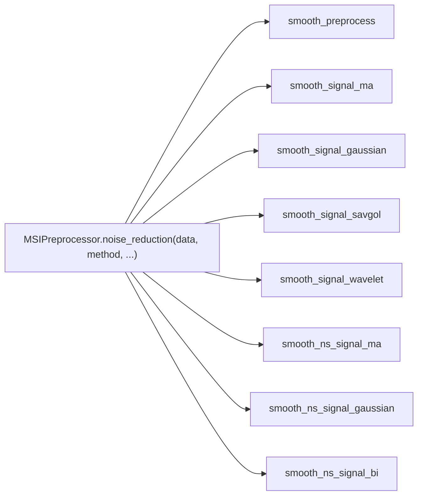

# MassFlow 

This document introduces the noise suppression and filtering module in MassFlow, focusing on the functions in `preprocess/filter.py` and their coordinated use with `MSIPreprocessor.noise_reduction`. The content includes API descriptions, example code, parameters and tuning suggestions, application scenarios, and common issues.
## Overview

- Input and Output
  - Input: `module.ms_module.SpectrumBaseModule` (1D `intensity` must exist; `mz_list` is optional)
  - Output: All function calls should be made through the MSIPreprocessor.noise_reduction method.
- Algorithm Categories
  - Time-domain convolution smoothing: `smooth_signal_ma` (moving average/custom kernel), `smooth_signal_gaussian` (discrete Gaussian)
  - Polynomial fitting smoothing: `smooth_signal_savgol` (Savitzky-Golay)
  - Wavelet denoising: `smooth_signal_wavelet` (thresholding based on PyWavelets)
  - Smoothing based on m/z neighborhood search: `smooth_ns_signal_ma`, `smooth_ns_signal_gaussian`, `smooth_ns_signal_bi` (bilateral)
- Preprocessing
  - `smooth_preprocess`: Sets negative intensities to zero, cleans up data references to avoid subsequent algorithm exceptions.

### Function Relationship Diagram



## Core API

### MSIPreprocessor.noise_reduction

```python
preprocess.ms_preprocess.MSIPreprocessor.noise_reduction(
  data: SpectrumBaseModule | SpectrumImzML,
  method: str = "ma",
  window: int = 2,
  sd: float = 2,
  sd_intensity: float | None = None,
  p: int = 2,
  coef: np.ndarray | None = None,
  polyorder: int = 2,
  wavelet: str = "db4",
  threshold_mode: str = "soft"
) -> SpectrumBaseModule | SpectrumImzML
```

- Description: Unified entry point for denoising. Dispatches to the specific filter implementation based on `method`, and returns a spectrum object with the same coordinates as the input, where `intensity` is the smoothed result.
- Supported `method`s:
  - `"ma"`, `"gaussian"`, `"savgol"`, `"wavelet"`
  - `"ma_ns"`, `"gaussian_ns"`, `"bi_ns"`
- Returns: A new `SpectrumBaseModule` (or `SpectrumImzML`) instance, with `mz_list` and coordinates preserved, and `intensity` replaced with the smoothed result.
- Exceptions: `ValueError` (unsupported method), `TypeError` (invalid input type).

### smooth_signal_ma

```python
preprocess.filter.smooth_signal_ma(
  x: SpectrumBaseModule,
  coef: np.ndarray | None = None,
  window: int = 5
) -> np.ndarray
```

- Description: Moving average (or custom convolution kernel) smoothing. Uses `edge` padding for 1D boundaries and automatically normalizes weights.
- Parameters(Note that only the following parameters are available, other parameters do not affect the effectiveness of this smoothing method.):
  - `coef`: Convolution kernel; if `None`, a uniform kernel of length `window` is used.
  - `window`: Window length (positive integer; if even, it is automatically adjusted to an odd number).
- Returns: A 1D `intensity` array of the same length as the input.
- Exceptions: `ValueError` (`window <= 0` when `coef` is not provided), `TypeError` (`intensity` is not 1D).

Example:

```python
import sys
import os
from pathlib import Path
import numpy as np
import matplotlib.pyplot as plt
from module.ms_module import MS, SpectrumBaseModule
from module.ms_data_manager_imzml import MSDataManagerImzML
from preprocess.ms_preprocess import MSIPreprocessor
from tools.plot import plot_spectrum

# Dataloading part only show once for blow examples
# Load data
# Data path
FILE_PATH = 'data/neg-gz4.imzML'
ms = MS()
ms_md = MSDataManagerImzML(ms, filepath=FILE_PATH)
ms_md.load_full_data_from_file()
sp = ms[0]

# Denoising processing (using directly set window size)
denoised_spectrum = MSIPreprocessor.noise_reduction(
    data=sp,
    method="ma",
    window=7  # Window size for moving average
)

# Plotting (overlay original and denoised)
plot_spectrum(
    base=sp,
    target=denoised_spectrum,
    figsize=(12, 8),
    dpi=300,
    plot_mode='line',
    mz_range=(500.0, 510.0),
    intensity_range=(0.0, 1.5),
    metrics_box=True,
    title_suffix='MA',
)
```


### smooth_signal_gaussian

```python
preprocess.filter.smooth_signal_gaussian(
  x: SpectrumBaseModule,
  sd: float | None = None,
  window: int = 5
) -> np.ndarray
```

- Description: Discrete Gaussian kernel smoothing; defaults to `sd = window / 4`.
- Parameters(Note that only the following parameters are available, other parameters do not affect the effectiveness of this smoothing method.): 
  - `sd` (Gaussian standard deviation), default `sd = window / 4.0`
  - `window` (odd length),default = 5

- Exceptions: `ValueError` (window is not positive), `TypeError` (`intensity` is not 1D).

Example:

```python
    denoised = MSIPreprocessor.noise_reduction(
        data=sp,
        method="gaussian",
        window=7,
        # If default, it is set to `window / 4.0`
        # sd=None
    )

    # Plotting (overlay)
    plot_spectrum(
        base=sp,
        target=denoised,
        figsize=(12, 8),
        dpi=300,
        plot_mode='line',
        mz_range=(500.0, 510.0),
        intensity_range=(0.0, 1.5),
        title_suffix='Gaussian',
    )
```


### smooth_signal_savgol

```python
preprocess.filter.smooth_signal_savgol(
  x: SpectrumBaseModule,
  window: int = 5,
  polyorder: int = 2
) -> np.ndarray
```

- Description: Savitzky-Golay polynomial fitting smoothing; automatically ensures `window` is odd and `window >= 3`.
- Dependencies: `scipy.signal.savgol_filter`.
- Parameters(Note that only the following parameters are available, other parameters do not affect the effectiveness of this smoothing method):
  - polyorder default = 2 `polyorder < window` (if not satisfied, it is automatically lowered).
  - window default =5

- Returns: A 1D `intensity` array of the same length as the input.

Example:

```python
	denoised = MSIPreprocessor.noise_reduction(
        data=sp,
        method="savgol",
        window=10,
        #window default = 5
        polyorder=1
        #polyorder default = 2
    )

    # Plotting (overlay)
    plot_spectrum(
        base=sp,
        target=denoised,
        figsize=(12, 8),
        dpi=300,
        plot_mode='line',
        mz_range=(500.0, 510.0),
        intensity_range=(0.0, 1.5),
        title_suffix='Savgol',
    )
```


​        *window*=3, polyorder*=1


### smooth_signal_wavelet

```python
preprocess.filter.smooth_signal_wavelet(
  x: SpectrumBaseModule,
  wavelet: str = "db4",
  threshold_mode: str = "soft"
) -> np.ndarray
```

- Description: Wavelet threshold denoising; automatically estimates noise and processes it using the Donoho-Johnstone threshold; the reconstructed length is strictly aligned with the input (truncated/padded if necessary).
- Dependencies: `pywt` (PyWavelets).
- Parameters(Note that only the following parameters are available, other parameters do not affect the effectiveness of this smoothing method.): 
  - `wavelet` (e.g., `db4`, `db8`, `haar`, `coif2`),default `db4`
  - `threshold_mode` (`soft`/`hard`),default `'soft'`


```python
    denoised = MSIPreprocessor.noise_reduction(
        data=sp,
        method="wavelet",
    )

    # Plotting (overlay)
    plot_spectrum(
        base=sp,
        target=denoised,
        figsize=(12, 8),
        dpi=300,
        plot_mode='line',
        mz_range=(500.0, 510.0),
        intensity_range=(0.0, 1.5),
        title_suffix='wavelet',
    )
```


### smooth_ns_signal_ma

```python
preprocess.filter.smooth_ns_signal_ma(
  x: SpectrumBaseModule,
  k: int = 5,
  p: int = 2
) -> np.ndarray
```

- Description: Performs equal-weight average smoothing over the m/z neighborhood (row-normalized).
- Parameters(Note that only the following parameters are available, other parameters do not affect the effectiveness of this smoothing method):  
  - `k` (number of neighbors),default 5,
  - `p` (distance metric),default 2.


```python
    denoised = MSIPreprocessor.noise_reduction(
        data=sp,
        method="ma_ns",
        window=10,#(window = k)
        #window default = 5
    )
    # Plotting (overlay)
    plot_spectrum(
        base=sp,
        target=denoised,
        figsize=(12, 8),
        dpi=300,
        plot_mode='line',
        mz_range=(500.0, 510.0),
        intensity_range=(0.0, 1.5),
        title_suffix='ma_ns',
        overlay=True
    )
```


### smooth_ns_signal_gaussian

```python
preprocess.filter.smooth_ns_signal_gaussian(
  x: SpectrumBaseModule,
  k: int = 5,
  p: int = 1,
  sd: float | None = None
) -> np.ndarray
```

- Description: Applies Gaussian weighting to neighborhood distances; the exponent is `clip`ped before numerical underflow, and row normalization avoids division by zero.
- Default: `sd = median(max_row_distance) / 2`.
- Parameters(Note that only the following parameters are available, other parameters do not affect the effectiveness of this smoothing method): 
  - `k`,(number of neighbors),default 5 
  - `p`, (distance metric),default 2.
  -  `sd`. (distance metric),default `np.*median*(dists_max) / 2.0` .


Example:

```python
    denoised = MSIPreprocessor.noise_reduction(
        data=sp,
        method="gaussian_ns",
        window=10,#(window = k)
        #window default = 5
    )

    # Plotting (overlay)
    plot_spectrum(
        base=sp,
        target=denoised,
        figsize=(12, 8),
        dpi=300,
        plot_mode='line',
        mz_range=(500.0, 510.0),
        intensity_range=(0.0, 1.5),
        title_suffix='gaussian_ns',
    )
```


### smooth_ns_signal_bi (Bilateral)

```python
preprocess.filter.smooth_ns_signal_bi(
  x: SpectrumBaseModule,
  k: int = 5,
  p: int = 2,
  sd_dist: float | None = None,
  sd_intensity: float | None = None
) -> np.ndarray
```

- Description: Bilateral weighting that considers both m/z distance and intensity difference; suitable for edge-preserving (peak position) smoothing.
- Parameters(Note that only the following parameters are available, other parameters do not affect the effectiveness of this smoothing method):
  -  `k: int = 5`
  -  `p: int = 2`
  - `sd_dist = median(max_row_distance) / 2`
  - `sd_intensity = scipy.stats.median_abs_deviation(intensity, scale="normal")`


Example:

```python
    denoised = MSIPreprocessor.noise_reduction(
        data=sp,
        method="bi_ns",
        window=10,#(window = k)
    )

    # Plotting (overlay)
    plot_spectrum(
        base=sp,
        target=denoised,
        figsize=(12, 8),
        dpi=300,
        plot_mode='line',
        mz_range=(500.0, 510.0),
        intensity_range=(0.0, 1.5),
        title_suffix='bi_ns',
    )
```

window =10


window=20:


## Parameter Descriptions and Tuning Suggestions

- `window` (Convolution/SG window)
  - Positive integer; even numbers are automatically converted to the nearest odd number (for center alignment).
  - Recommendation: 5–15 (adjust based on peak width and noise intensity).
- `coef` (Custom convolution kernel)
  - Automatically normalized when passed; its length determines the effective window.
- `sd` (Standard deviation of Gaussian kernel)
  - Classic convolution defaults to `sd = window / 4`.
  - Neighborhood Gaussian defaults to `sd = median(max_row_distance) / 2` (data-adaptive).
- `polyorder` (Polynomial order for SG)
  - Must be less than `window`; recommended 1-2.
- `wavelet` and `threshold_mode`
  - Recommendation: `db4` + `soft`; for strong noise, try `hard`.
- `k` (Number of neighbors for neighborhood search)
  - `k >= 1`; too large can lead to over-smoothing; generally 5–11.
- `p` (Minkowski distance parameter)
  - `p=1` for Manhattan, `p=2` for Euclidean; higher `p` emphasizes distance differences more.
- `sd_intensity` (Scale of intensity difference weight for bilateral filter)
  - Defaults to the `median_abs_deviation` of the intensity (robust).

## References

- `preprocess/filter.py` (Core implementation of filtering/denoising)
- `preprocess/ms_preprocess.py` (Unified entry point and parameter dispatch)
- `module/ms_module.py` (Data structure and visualization for `SpectrumBaseModule`)