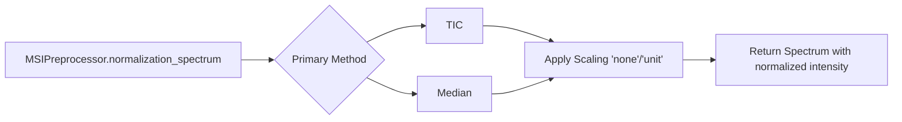

# MassFlow

This document introduces the normalization module in MassFlow, focusing on the unified entry `MSIPreprocessor.normalization_spectrum` and helper functions defined in `preprocess/normalizer_helper.py`. It provides an overview, API specification, example code, parameter notes, and troubleshooting tips.

## Overview
- Input and output
  - Input: `module.ms_module.SpectrumBaseModule` (with 1D `intensity` and optional `mz_list`)
  - Output: A new `SpectrumBaseModule` with the same `mz_list` and coordinates; `intensity` is replaced by normalized (and optionally scaled) values.
- Methods
  - TIC (Total Ion Current) normalization: scales intensities such that the sum equals 1.
  - Median normalization: scales intensities such that the median equals 1.
- Additional scaling
  - `scale_method` supports:
    - `'none'`: no extra scaling
    - `'unit'`: min-max scaling to `[0, 1]` 

### Function Relationship Diagram



## Core API

### MSIPreprocessor.normalization_spectrum

```python
preprocess.ms_preprocess.MSIPreprocessor.normalization_spectrum(
  data: SpectrumBaseModule | SpectrumImzML,
  scale_method: str = "none",
  method: str = "tic"
) -> SpectrumBaseModule | SpectrumImzML
```

- Description: Unified entry for spectrum normalization. Dispatches to TIC or median normalization and optionally applies post-scaling. Returns a spectrum object preserving `mz_list` and coordinates, with normalized `intensity`.
- Supported `method`s:
  - `'tic'` (sum equals 1)
  - `'median'` (median equals 1)
- Supported `scale_method`s:
  - `'none'` (no extra scaling)
  - `'unit'` (min-max scaling to `[0, 1]`)
- Returns: A new `SpectrumBaseModule` (or `SpectrumImzML`) instance, preserving `mz_list` and coordinates.
- Exceptions:
  - `ValueError`: Unsupported `method`, or invalid TIC/median (≤ 0) in helper functions.

### Helper functions (preprocess/normalizer_helper.py)

- `tic_normalize(intensity, scale_method='none') -> np.ndarray`  
  Scales the array by its sum; raises `ValueError` if sum ≤ 0. Optionally applies min-max scaling.
- `median_normalize(intensity, scale_method='none') -> np.ndarray`  
  Scales the array by its median; raises `ValueError` if median ≤ 0. Optionally applies min-max scaling.
- `apply_scaling(intensity, scale_method) -> np.ndarray`  
  `'none'` or `'unit'` min-max scaling to `[0, 1]`.
- `normalizer(intensity, scale_method='none', method='tic') -> np.ndarray`  
  Dispatcher to TIC or median normalization with validation.

## Examples

### TIC normalization (after Savitzky-Golay denoising)

```python
import sys
import os
import numpy as np
from module.ms_module import MS
from module.ms_data_manager_imzml import MSDataManagerImzML
from preprocess.ms_preprocess import MSIPreprocessor
from tools.plot import plot_spectrum

FILE_PATH = "data\\neg-gz4.imzML"
ms = MS()
ms_md = MSDataManagerImzML(ms, filepath=FILE_PATH, coordinates_zero_based=False)
ms_md.load_full_data_from_file()
sp = ms[0]
# Denoise then normalize
denoised = MSIPreprocessor.noise_reduction_spectrum(
    data=sp,
    method="savgol",
    window=11,
    polyorder=3
)
normalized_tic = MSIPreprocessor.normalization_spectrum(
    data=denoised,
    method="tic",
    scale_method="none"
)

tic_origin = float(np.sum(denoised.intensity))
tic_after = float(np.sum(normalized_tic.intensity))
print(f"TIC normalized sum={tic_after:.6f}")

plot_spectrum(
    base = denoised,
    mz_range=(500.0, 510.0),
    intensity_range=(0.0, 1.5),
    title_suffix='Savgol_denoised'
)

plot_spectrum(
    base=normalized_tic,
    mz_range=(500.0, 510.0),
    intensity_range=(0.0, 1.5 / tic_origin),
    title_suffix='TIC_normalized_none'
)
```


### Median normalization (after Savitzky-Golay denoising)
```python
denoised = MSIPreprocessor.noise_reduction_spectrum(
    data=sp,
    method="savgol",
    window=11,
    polyorder=3
)
med_origin = float(np.median(denoised.intensity))
normalized_med = MSIPreprocessor.normalization_spectrum(
    data=denoised,
    method="median",
    scale_method="none"
)
med_after = float(np.median(normalized_med.intensity))
print(f"Median_value_after={med_after:.6f}")

plot_spectrum(
    base=normalized_med,
    mz_range=(500.0, 510.0),
    intensity_range=(0.0, 1.5 / med_origin),
    title_suffix='Median_normalized_none'
)
```


### Optional 0–1 scaling (unit scaling)

```python
normalized_unit = MSIPreprocessor.normalization_spectrum(
    data=denoised,
    method="tic",          # or "median"
    scale_method="unit"    # min-max scaling to [0, 1]
)
plot_spectrum(
        base = normalized_unit,
        mz_range=(500.0, 510.0),
        intensity_range=(0.0, 0.1),
        title_suffix='TIC_normalized_unit'     
    )
```


- Use `'unit'` to scale the normalized intensity to `[0, 1]` for consistent visualization/comparison across spectra.

## Parameters and Tuning
- General
  - Choose `'tic'` for consistent total intensity across pixels; suitable for visualization, relative quantitation.
  - Choose `'median'` to reduce the influence of extreme values; robust for noisy spectra.
  - Use `'unit'` scaling for plotting or UI normalization; avoid if you need numeric properties like sum=1 or median=1 to remain interpretable.
- TIC
  - Sensitive to large peaks; consider prior denoising/baseline correction.
- Median
  - More robust against heavy-tailed distributions; preserves rank structure.

## Troubleshooting
- `ValueError: TIC value is not greater than 0`  
  Ensure the spectrum has non-zero sum after preprocessing; avoid using entirely empty or clipped spectra.
- `ValueError: Median value is not greater than 0`  
  Ensure intensities are not all zero; consider baseline correction or avoiding aggressive clipping.
- Unsupported method or scale_method  
  Check spelling: `method='tic'|'median'`, `scale_method='none'|'unit'`.

## References
- `preprocess/normalizer_helper.py` (TIC/median implementations and scaling)
- `preprocess/ms_preprocess.py` (Unified entry point and parameter dispatch)
- `module/ms_module.py` (Data structure for `SpectrumBaseModule`)
- `tools/plot.py` (Plotting utilities for `SpectrumBaseModule`)