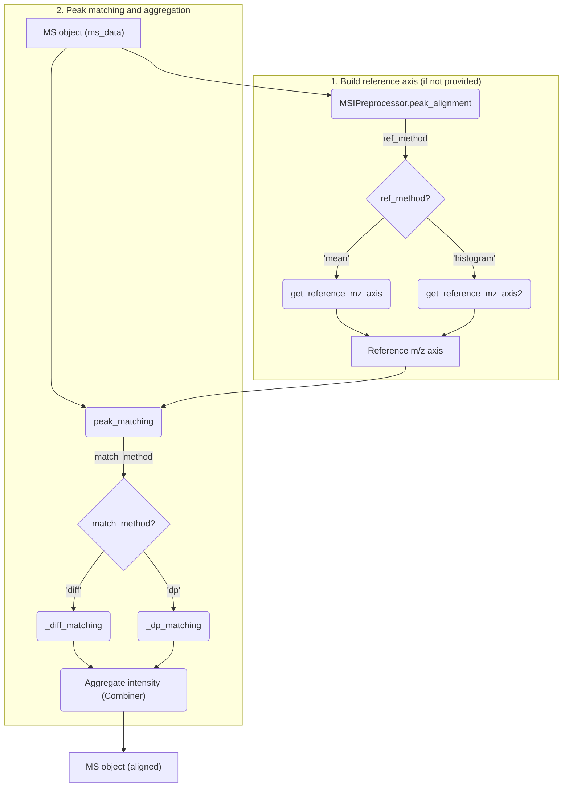

# Peak Alignment

This document systematically describes the MSI peak alignment workflow and implementation in MassFlow, covering reference m/z axis construction, per-pixel peak matching and aggregation, tolerance estimation, and the unified API. The implementation mainly resides in:
- `preprocess/peak_alignment.py`
- `preprocess/ms_preprocess.py`

## Overview
1. Two-stage pipeline:

   - Reference axis construction (ref_method): extract a strictly increasing “reference m/z axis” from the full dataset (or a sample).
     - ref_method = 'mean' (default): aggregate all spectra to compute a global mean spectrum, then detect peaks on the mean spectrum.
     - ref_method = 'histogram': use a global m/z histogram + LOESS smoothing to identify high-frequency peaks.

   - Peak matching and aggregation: centroid peaks of each pixel are matched to the reference axis under tolerance gating, and intensities are aggregated by rule.

2. Unified entry: `MSIPreprocessor.peak_alignment` supports two reference-axis methods and two matching methods, and allows overriding tolerance and units as needed.

Flowchart:



## Internal Functions
### Mean spectrum + local maxima (Mean Method)
- Function: `get_reference_mz_axis`
- Idea:
  1) Compute the global mean spectrum (aggregate centroid peaks per pixel keyed by rounded m/z, `agg='mean'|'sum'`), see `_compute_mean_spectrum`.
  2) Detect peaks on the mean spectrum intensity array using local maxima, see `_find_peaks_from_array`.
  3) Deduplicate and sort reference peaks (merge close peaks by minimum Da distance).
- Key parameters:
  - `agg`, `round_digits` control aggregation granularity of the mean spectrum.
  - `half_window`, `snr_threshold`, `noise_method`, `min_height` for peak detection and robustness.
  - `min_distance_da` or auto-estimated value times `min_distance_factor` controls the deduplication threshold.
- Returns: a strictly increasing `np.ndarray` as the reference m/z axis.

### Histogram + LOESS (Histogram/Loess Method)
- Function: `get_reference_mz_axis2`
- Idea:
  1) Sample pixels and collect all centroid m/z values; build a global m/z histogram with bin width set by `mz_res`.
  2) Apply LOESS smoothing to the histogram (`_smooth1d`).
  3) Detect peaks on the smoothed curve, and filter by the original histogram height and `px_perc`.
- Key parameters:
  - `mz_res` (bin width; supports `None` to trigger adaptive estimation).
  - `px_perc` (approximate threshold for pixel coverage).
  - `N_sample` (number of sampled pixels; `None` means full dataset).
  - `smoothing_window` (smoothing window; odd numbers preferred).

### Diff nearest neighbor (Diff Matching)
- Function: `_diff_matching`.
- Algorithm: for each pixel peak `x`, binary-search the insertion position in the reference axis `y` and check both neighbors; if `|x - y|` is within tolerance, choose the closer one.
- Complexity: approximately `O(m log n)` (m = number of pixel peaks, n = length of reference axis).
- Features: supports `unique=True` (each reference peak matched at most once); `fill_value` controls value for unmatched entries.

### Dynamic programming with monotonic constraint (DP Matching)
- Function: `_dp_matching`.
- Algorithm: global optimal matching under monotonic and one-to-one constraints; score is `1/(1+|x - y|)`. Matching is allowed only within tolerance; default `gap=0` (no penalty for skipping).
- Complexity: `O(m·n)`; suitable for crowded or cross-risk peak scenarios, not recommended by default on large datasets.

### Aggregation strategy (Combiner)
- In `peak_matching`, aggregate intensities matched to the same reference peak:
  - `sum`: sum matched peaks within each pixel; good for quantitative consistency.
  - `mean`: divide by match count; suppresses inflation from repeated matches.
  - `max`: keep the maximum; emphasizes presence but may underestimate totals.

### Resolution/Tolerance estimation
- Function: `_estimate_mass_resolution`.
- Output: returns “half-width tolerance” (not full resolution) used for match gating; unit controlled by `units='ppm'|'da'`.
- Principle: compute adjacent m/z gaps on sampled pixels, apply IQR outlier removal, estimate typical value with median or MAD, then multiply by `gap_to_tol_factor` to obtain half-width.
- Fallback: when estimation is unstable, fall back to default values (ppm or Da), with logging.

## Unified API (MSIPreprocessor)
- Function: `MSIPreprocessor.peak_alignment`.
- Behavior:
  - If `reference_mz_axis` is not provided, choose the reference-axis builder based on `ref_method='mean'|'histogram'`.
  - Then call `peak_matching` on the full dataset to perform alignment.
- Important parameters:
  - Reference axis: `agg`, `round_digits`, `half_window`, `snr_threshold`, `min_height`, `min_distance_da|min_distance_factor`; or `mz_res|px_perc|N_sample|smoothing_window`.
  - Matching: `units='ppm'|'da'`, `tolerance=None|float`, `match_method='diff'|'dp'`, `combiner='sum'|'mean'|'max'`, `unique`.
  - Tolerance estimation: `n_sample` (number of sampled spectra) and `gap_to_tol_factor`.
- Returns: a new `MS` object whose spectra share the same reference axis.
- Examples:

```python
>>> # Example 1: Run peak alignment (use 'mean' method to auto-build reference axis)
>>> ms_aligned_mean = MSIPreprocessor.peak_alignment(
...     ms_data=ms,
...     ref_method='mean',       # Use mean spectrum method
...     reference_mz_axis=None,  # Auto-build reference axis
...     tolerance=None,          # Auto-estimate tolerance
...     units='ppm',             # Use ppm as tolerance unit
...     combiner='max',          # Aggregate intensity by max
... 
...     # --- Parameters passed to get_reference_mz_axis ---
...     agg='mean',
...     round_digits=6,
...     half_window=1,
...     min_distance_factor=0.5,
...     n_sample=2000,           # Used for both reference axis construction and alignment
... 
...     # --- Parameters passed to peak_matching ---
...     gap_to_tol_factor=0.5,
...     match_method='diff'      # Use fast diff matching
... )
>>> 
>>> # Example 2: Run peak alignment (use 'histogram' method)
>>> ms_aligned_hist = MSIPreprocessor.peak_alignment(
...     ms_data=ms,
...     ref_method='histogram',  # Use histogram method
...     reference_mz_axis=None,
...     tolerance=None,
...     units='ppm',
...     combiner='max',
...     match_method='diff',
... 
...     # --- Parameters passed to get_reference_mz_axis2 ---
...     mz_res=0.05,
...     px_perc=0.01,
...     N_sample=None,           # Use full dataset
... 
...     # --- Parameters passed to peak_matching ---
...     n_sample=2000,
...     gap_to_tol_factor=0.5
... )
```

## Performance and Robustness
- Performance:
  - `diff` is approximately `O(m log n)`, suitable for large scale; `dp` is `O(m·n)`, use with caution.
  - Histogram method: when `N_sample` is large and `mz_res` is very small (many bins), memory and time increase significantly; adopt sampling and reasonable bin widths.
- Robustness:
  - Noise estimation uses MAD for better stability (`_find_peaks_from_array`).
  - Tolerance estimation supports IQR outlier removal and MAD/median approaches .

## Common Issues and Optimization
- Too many matching failures: tolerance too small or unit inappropriate (ppm too small at low m/z); increase `gap_to_tol_factor` or switch to `units='da'`.
- Extreme runtime: `dp` is unacceptable on large data; histogram method with `N_sample=None` and extremely fine bins will increase runtime and memory.